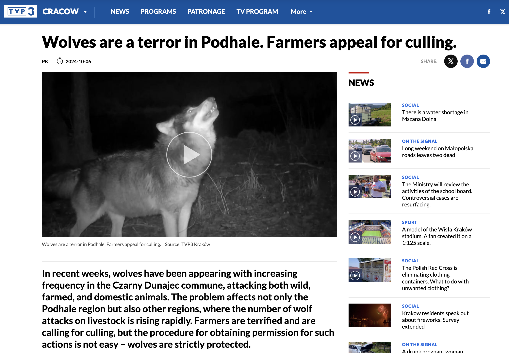
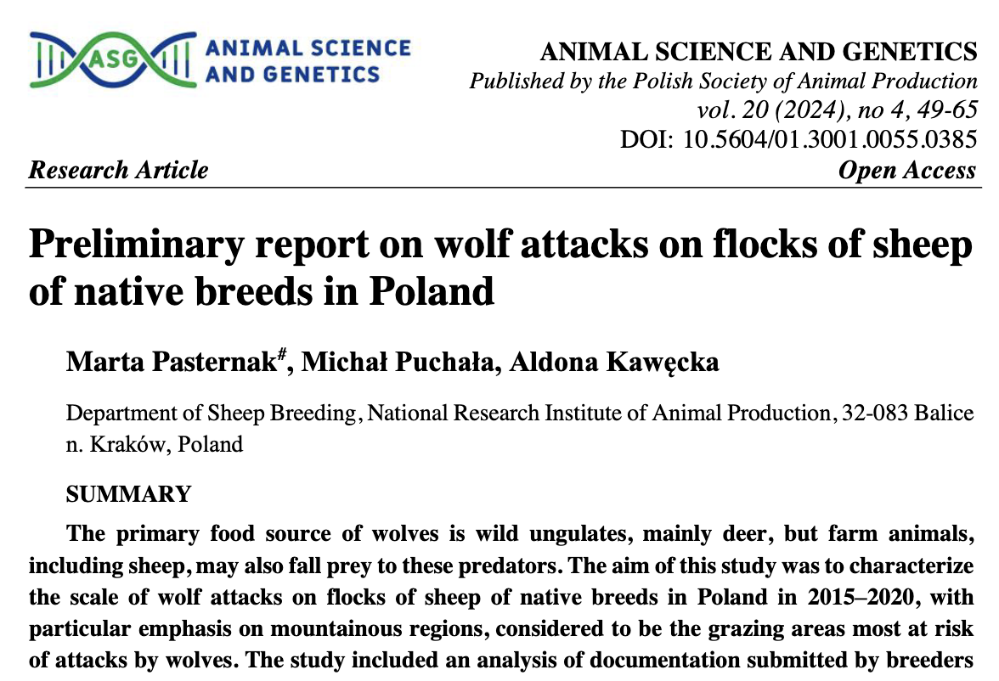
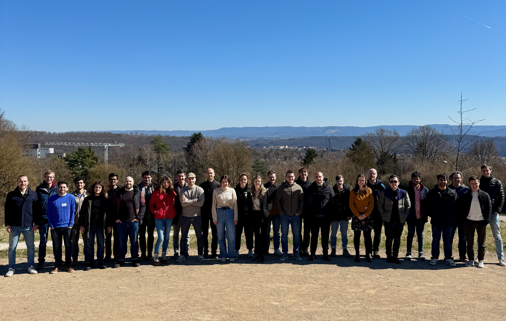

<!-- _class: lead -->

# Beyond Likelihoods: Bayesian Parameter Inference for Black-Box Simulators with sbi

## A Hands-On Introduction to Simulation-Based Inference

**EuroSciPy 2025** | Kraków, Poland | 90 minutes
**Case Study:** Ecological Monitoring with Limited Data

Jan Teusen (Boelts) | TransferLab, appliedAI Institute for Europe

📱 **Materials:** `github.com/janfb/euroscipy-2025-sbi-tutorial`

<br>


<!--
Speaker notes:
- Welcome everyone!
- Check that everyone can access the materials
- Mention helpers are available for setup issues
- Today: from theory to practice with your own simulators
-->

---

# 🐺 A Real Conservation Crisis in Poland

## October 2024: Headlines from Southern Poland

<div class="columns">
<div>



**TVP Kraków Reports:**
*"Wolves are the terror of Podhale. Farmers are calling for a cull"*

</div>
<div>

### The Crisis
- **Wolf attacks increasing** south Poland
- Targeting livestock and domestic animals
- **Farmers demanding action**
- **Wolves strictly protected** by law

</div>
</div>

<!--
Speaker notes:
- This is happening RIGHT NOW, just south of Kraków
- Real farmers losing real livestock
- Deep conflict between conservation law and traditional farming
- Not an abstract problem - affects real families and communities
-->

---

# 📊 The Science: Escalating Wolf-Sheep Conflicts

## Research Confirms the Growing Problem

<div class="columns">
<div>



**Pasternak et al. (March 2025):**
*"Preliminary report on wolf attacks on flocks of sheep"*

</div>
<div>

### Key Findings (2015-2020)
- **76.9% of attacks** in southern Poland
- **Peak season:** July-August
- **Trend:** Increasing year over year
- **Most affected:** Podhale Zackel sheep

<br>

> *"Methods of protecting flocks should be improved"*

</div>
</div>

<!--
Speaker notes:
- Published research confirms the news reports
- Systematic increase in conflicts
- Concentrated in Carpathian mountain regions
- Need science-based management decisions
-->

---

# 🎯 Your Mission: Inform Policy Decisions

## You're consulting for the State Environmental Agency

<div class="columns">
<div>

### The Dilemma

- **Conservation success:** Wolves recovering after near-extinction
- **Economic impact:** Farmers losing livestock
- **Policy question:** How much culling?

### Your Task

- Model wolf-deer dynamics
- Infer population parameters
- **Provide uncertainty estimates**

</div>
<div>

### Available Data

```python
# Summary statistics from monitoring
observations = {
    "deer_mean": 45.2,
    "wolf_mean": 8.7,
    "deer_std": 12.1,
    "wolf_std": 2.4,
    "max_counts": [78, 15],
    "correlations": 0.82
}
```

<br>

**Challenge:** From limited data, infer ecosystem dynamics to guide policy

</div>
</div>

<!--
Speaker notes:
- You're the technical expert advising government
- Decisions affect both conservation and livelihoods
- Need rigorous uncertainty quantification
- Real consequences to getting this wrong
-->

---

# 🔬 Our Tool: The Lotka-Volterra Model

## Classic predator-prey dynamics

<div class="columns">
<div>

### The Equations

$$\frac{dx}{dt} = \alpha x - \beta xy$$
$$\frac{dy}{dt} = \delta xy - \gamma y$$

- $x$ = deer population
- $y$ = wolf population
- $\alpha$ = deer birth rate
- $\beta$ = predation rate
- $\delta$ = wolf efficiency
- $\gamma$ = wolf death rate

</div>
<div>

### Why This Model?

- **Well-understood** ecological dynamics
- **Captures oscillations** seen in nature
- **Parameters map** to real processes
- **Fast to simulate** (enables SBI)

```python
def lotka_volterra(params):
    α, β, δ, γ = params
    # Simulate populations
    return deer, wolves
```

</div>
</div>

> **Next challenge:** How do we infer these parameters from observations?

<!--
Speaker notes:
- Classic model from 1920s, still widely used
- Simple but captures essential dynamics
- Parameters have biological meaning
- Perfect for demonstrating SBI principles
-->

---

# The Traditional Approach: Optimization

<div class="columns">
<div>

### Finding the "best" parameters

```python
# Grid search or optimization
best_params = optimize(
    simulator,
    observed_data
)
```

✅ **Gives an answer**
❌ **No uncertainty**
❌ **Misses alternatives**

</div>
<div>

### The result: A single point

```
α* = 0.52  # Birth rate
β* = 0.024 # Predation
δ* = 0.011 # Efficiency
γ* = 0.48  # Death rate
```

**But how confident are we?**

</div>
</div>

<!--
Speaker notes:
- Optimization finds ONE set of parameters
- No sense of uncertainty or confidence
- Can't answer: "What else could it be?"
- Critical for decision making
-->

---

# 🎯 The Hidden Problem

## **Many parameters can explain your data!**

<div class="highlight">

### Three different parameter sets, similar observations:

| Parameters | α | β | δ | γ | Result |
|-----------|---|---|---|---|---------|
| **Set 1** | 0.52 | 0.024 | 0.011 | 0.48 | ✓ Matches |
| **Set 2** | 0.48 | 0.026 | 0.009 | 0.51 | ✓ Matches |
| **Set 3** | 0.55 | 0.022 | 0.012 | 0.45 | ✓ Matches |

</div>

<br>

> **Which one is correct?** 🤔
> **What about future predictions?** 📈

<!--
Speaker notes:
- This is the core problem!
- All three produce similar observations
- But might give VERY different future predictions
- Need to quantify this uncertainty
-->

---

# What We Really Want: Distributions

<div class="columns">
<div>

### ❌ Point Estimate
- Single "best" value
- No uncertainty
- False confidence
- Poor predictions

</div>
<div>

### ✅ Posterior Distribution
- **Range of plausible values**
- **Quantified uncertainty**
- **Parameter correlations**
- **Robust predictions**

</div>
</div>

<br>

> **Goal:** `p(parameters | observation)`
> The probability distribution of parameters given what we observed

<!--
Speaker notes:
- Shift from optimization to Bayesian inference
- Want full distribution, not just point
- Shows what we're confident about vs uncertain
- Reveals correlations between parameters
-->

---

# The Likelihood Problem

## Why can't we just use Bayes' rule?

### Bayes' Rule:

$$p(θ|x) ∝ p(x|θ) × p(θ)$$

<br>


<div class="highlight">

**For complex simulators:**
- 📦 **Black-box:** No analytical likelihood `p(x|θ)`
- 🐌 **Slow:** Likelihood evaluations infeasible

</div>

<br>

**Examples:** Climate models, neural circuits, epidemics, cosmology...

<!--
Speaker notes:
- Traditional Bayesian inference needs likelihood
- Most simulators don't have tractable likelihoods
- Can't write down p(x|θ) mathematically
- This is where SBI comes in!
-->

---

# 🚀 Enter: Simulation-Based Inference

## Let neural networks learn from simulations!

```python
# The SBI workflow
1. parameters ~ prior()           # Sample parameters
2. data = simulator(parameters)   # Run simulation
3. train neural_network on (parameters, data) pairs
4. posterior = neural_network(observed_data)  # Inference!
```

<div class="highlight">

**Key insight:** Turn inference into supervised learning!
- No likelihood needed ✓
- Works with any simulator ✓
- Learns from examples ✓

</div>

<!--
Speaker notes:
- Core innovation: use ML for Bayesian inference
- Generate training data by running simulator
- Neural network learns parameter-data relationship
- At test time: input observation, get posterior
-->

---

# What You'll Learn Today

## Three hands-on exercises, progressive difficulty

<div class="columns">
<div>

### 📓 Exercise 1: First inference

**15 minutes**
- Load Lotka-Volterra simulator
- Run NPE in 5 lines
- Visualize posterior
- See uncertainty!

</div>
<div>

### 🔍 Exercise 2: Trust & Verify
**20 minutes**
- Posterior predictive checks
- Coverage diagnostics
- Warning signs
- "Can I trust this?"

</div>
</div>

<div class="center">

### 🚀 Exercise 3: Your Problem

**20 minutes**

- Adapt template to your simulator, OR use provided examples

</div>

<!--
Speaker notes:
- All code provided - focus on understanding
- Solutions available if stuck
- Goal: you leave able to apply this
-->

---

<!-- _class: lead -->

# Part 2: Core Intuition
## Two Approaches to SBI

---

# Classical vs Modern SBI

<div class="columns">
<div>

### 📚 Classical: Rejection Sampling

- Simple and intuitive
- No neural networks
- Inefficient in high-D
- Good for understanding

</div>
<div>

### 🧠 Modern: Density Estimation

- Efficient and scalable
- Amortized inference
- Handles high-D
- Powers the `sbi` package

</div>
</div>

<br>

> We'll see both for intuition, then use the modern approach

<!--
Speaker notes:
- Start with rejection for intuition
- Understand why we need neural methods
- Then dive into NPE
-->

---

# Rejection Sampling in 5 Lines

```python
# The simplest SBI algorithm
accepted_params = []

for _ in range(n_simulations):
    θ = prior.sample()                    # 1. Sample parameters
    x_sim = simulator(θ)                  # 2. Simulate data
    if distance(x_sim, x_obs) < ε:        # 3. Accept if close
        accepted_params.append(θ)         # 4. Store accepted

posterior_samples = accepted_params       # 5. These approximate p(θ|x)
```
<br>

<div class="highlight">

**Intuition:** Keep parameters that produce data similar to observations

</div>

<!--
Speaker notes:
- Dead simple algorithm
- Directly implements the idea
- But watch what happens with dimensions...
-->

---

# The Curse of Dimensionality

## Acceptance rate drops exponentially! 📉

| Dimensions | Acceptance Rate | Simulations for 1000 samples |
|------------|----------------|------------------------------|
| **2D** | 10% | 10,000 ✅ |
| **5D** | 0.1% | 1,000,000 😐 |
| **10D** | 0.00001% | 10,000,000,000 ❌ |

<br>

<div class="highlight">

**Problem:** In high dimensions, almost nothing is "close" to your observation

</div>

<br>

> **Solution:** Learn the relationship instead of rejecting!

<!--
Speaker notes:
- This is why we need neural methods
- Can't afford billions of simulations
- Most real problems are >10D
-->

---

# Neural Posterior Estimation (NPE)

## Learning to predict _distributions_ given data

<div class="columns">
<div>

### The Network

**Input:** Observed data `x`
**Output:** Distribution `p(θ|x)`

```python
# Training
for θ, x in training_data:
    loss = -log q(θ|x)
    optimize(loss)

# Inference (instant!)
posterior = q(θ|x_observed)
```

</div>
<div>

### Key Innovation

Transform inference into **supervised learning**

1. Generate training pairs
2. Train neural density estimator
3. Amortized inference

**Result:** Instant posterior for any observation!

</div>
</div>

<!--
Speaker notes:
- Like training an image classifier
- But output is a probability distribution
- Uses normalizing flows for flexibility
- Train once, use many times
-->

---

# How NPE Training Works

## Three simple steps:

### 1️⃣ **Generate Training Data**
```python
for i in range(n_simulations):
    θ[i] ~ prior()
    x[i] = simulator(θ[i])
```

### 2️⃣ **Train Neural Network**
```python
neural_net = NeuralPosterior()
neural_net.train(parameters=θ, observations=x)
```

### 3️⃣ **Get Posterior (instant!)**
```python
posterior = neural_net(x_observed)
samples = posterior.sample(10000)  # Milliseconds!
```

<!--
Speaker notes:
- Emphasize simplicity
- Most complexity hidden in neural network
- User just needs to provide simulator
-->

---

# The Power of Amortization

## Train once, infer many times! ⚡

| Method | New observation | Computational Cost |
|--------|-----------------|-------------------|
| **MCMC** | Re-run everything | Hours ⏰ |
| **Rejection** | Re-run everything | Hours ⏰ |
| **NPE** | Forward pass | **Milliseconds!** ⚡ |

<div class="highlight">

**Perfect for:**
- Real-time applications
- Interactive exploration
- Multiple observations
- Experimental design

</div>

<!--
Speaker notes:
- This is the killer feature!
- Train overnight, deploy in production
- Enables real-time decision making
- Game-changer for many fields
-->

---

<!-- _class: lead -->

# 🚀 Let's Code!

## Three exercises, increasing complexity

### 📓 **Exercise 1:** First Inference (15 min)
### 🔍 **Exercise 2:** Diagnostics (20 min)
### 🎯 **Exercise 3:** Your Problem (20 min)

<br>

> **Setup check:** Can everyone run this?

```python
import sbi
import torch
print("Ready for SBI! 🚀")
```

<!--
Speaker notes:
- Check everyone is ready
- Helpers available for issues
- Colab backup if needed
- Let's start with Exercise 1!
-->

---

# Exercise 1: Your First Inference

## Wolf-Deer Dynamics from Summary Statistics!

```python
# The entire SBI workflow
from sbi.inference import NPE

# 1. Setup: simulator outputs summary stats
θ = prior.sample((10_000))
x = lambda θ: compute_summary_stats(lotka_volterra(θ))

# 2. Train neural network on summary statistics
npe = NPE(prior)
npe.append_simulations(θ, x).train()

# 3. Infer parameters from observed summaries
posterior = npe.build_posterior()

# 4. Sample & visualize uncertainty!
samples = posterior.sample((1000,), x=observed_stats)
```

**📝 Open notebook:** [`01_first_inference.ipynb`](../src/01_first_inference.ipynb)

<!--
Speaker notes:
- Walk through each line
- Emphasize simplicity
- 15 minutes for this exercise
- Solutions available if stuck
-->

---

# Exercise 2: Trust but Verify

## Critical with Summary Statistics! 🔍

**Why extra important?** SBI is approximate → Needs validation!

### Four key diagnostics:

<div class="columns">
<div>

### 1. Prior Predictive Check
- Can prior generate observations?
- Catch bad prior specification

### 2. Training Diagnostics
- Did neural network converge?
- Check for overfitting

</div>
<div>

### 3. Posterior Predictive Check
- Can posterior recreate data?
- Validates summary statistics choice

### 4. Simulation-Based Calibration
- Are credible intervals calibrated?
- 90% CI contains truth 90% of time?

</div>
</div>

**📝 Open notebook:** [`02_diagnostics.ipynb`](../src/02_diagnostics.ipynb)

<!--
Speaker notes:
- Critical for real applications
- Never trust without verification
- These catch most problems
- 20 minutes for this exercise
-->

---

# Exercise 3: Your Own Problem

## Three options:

### 🔬 **Option A: Your Simulator**
If you brought one, we'll adapt it!

### 🎾 **Option B: Ball Throw Physics**
Simple projectile motion with air resistance

### 🦠 **Option C: SIR Epidemic Model**
Disease spread dynamics


**📝 Open notebook:** [`03_your_problem.ipynb`](../src/03_your_problem.ipynb)

<!--
Speaker notes:
- Most exciting part!
- Apply to real problems
- Template handles boilerplate
- Focus on science, not code
- 20 minutes
-->

---

<!-- _class: lead -->

# Part 4: Next Steps
## Where to go from here

---

# Beyond NPE: The Full SBI Toolbox

| Method | What it learns | Best for | Key advantage |
|--------|---------------|----------|---------------|
| **NPE** | `p(θ\|x)` | Fast amortized inference | Instant posteriors |
| **NLE** | `p(x\|θ)` | MCMC sampling | Exact inference |
| **NRE** | `p(θ,x)/p(θ)p(x)` | Model comparison | Hypothesis testing |
| **Sequential** | Iteratively | Sample efficiency | 10x fewer simulations |

<br>

<div class="highlight">

All available in the `sbi` package with the same interface!

</div>

<!--
Speaker notes:
- NPE is just the beginning
- Each method has strengths
- Sequential great for expensive simulators
- Same API for all methods
-->

---

# ⚠️ Common Pitfalls & Solutions

### Learn from our mistakes!

| Pitfall | Consequence | Solution |
|---------|-------------|----------|
| **Prior too wide** | Wasted simulations | Use domain knowledge |
| **Too few simulations** | Poor approximation | Use diagnostics! |
| **Ignoring diagnostics** | False confidence | Always verify |
| **Poor summary stats** | Information loss | Include diverse statistics |
| **Assuming sufficiency** | Missing key info | Test with diagnostics |

<br>
<div class="highlight">

> **Golden rule:** Always validate your results!

</div>

<!--
Speaker notes:
- These are the most common issues
- Diagnostics catch most problems
- Prior choice is crucial
- With summary stats: always question sufficiency
- Our case: privacy forces summary stats, so diagnostics critical!
-->

---

# Advanced Topics

## Where to dive deeper 🏊

<div class="columns">
<div>

### Methods
- [NLE+`pyro` (**Talk Wed, 11:40, 1.38**](https://euroscipy.org/talks/KCYYTF/))
- Multi-round inference (sequential)
- Flow matching, diffusion models
- Tabular Foundation Models for NPE

</div>
<div>

### Applications
- Hierarchical Bayesian inference
- Expensive simulators
- High-dimensional problems
- Training-free SBI

</div>
</div>

<br>

> 📚 **Resources:** Papers, tutorials, and examples at [sbi.readthedocs.io](https://sbi.readthedocs.io/en/latest/)

<!--
Speaker notes:
- Rich research area
- Active development
- Many advanced features
- Great community support
-->

---

# 🌍 Real-World Applications

## SBI in the wild

<div class="columns">
<div>

### Science

- 🧠 **Neuroscience:** [Neural circuits](https://elifesciences.org/articles/56261)
- 🦠 **Epidemiology:** [COVID-19 models](https://arxiv.org/abs/2005.07062)
- 🌍 **Climate:** [Weather prediction](https://gmd.copernicus.org/articles/14/7659/2021/gmd-14-7659-2021.html)
- 🔬 **Physics:** [Gravitational waves](https://journals.aps.org/prl/abstract/10.1103/PhysRevLett.127.241103)
- 🧬 **Biology:** [Gene regulation](https://link.springer.com/article/10.1186/s13059-021-02289-z)

</div>
<div>

### Engineering
- 🚗 **Automotive:** [Safety testing](https://2025.uncecomp.org/proceedings/pdf/21274.pdf)
- 📞 **Telecomm.:** [Radio propagation](https://arxiv.org/abs/2410.07930)

</div>
</div>

<br>

<div class="highlight">

[Webapp with overview of SBI applications](https://sbi-applications-explorer.streamlit.app/)

</div>
<!--
Speaker notes:
- Wide adoption across fields
- Growing rapidly
- Many success stories
- Your problem probably fits!
-->

---

# Join the SBI Community!


*SBI Hackathon 2025, Tübingen - Join us next time!*

---

<div class="columns">
<div>

### 📦 **The Package**

- GitHub: [github.com/sbi-dev/sbi](https://github.com/sbi-dev/sbi)
- 700+ stars, 82+ contributors
- Active development

### 💬 **Get Help & Connect**

- [GitHub Discussions](https://github.com/sbi-dev/sbi/discussions)
- [Discord Server](https://discord.gg/eEeVPSvWKy)
- [🦋 Bluesky](https://bsky.app/profile/sbi-devs.bsky.social)

</div>
<div>

### 📚 **Resources**

- [Documentation](https://sbi.readthedocs.io/en/latest/)
- [JOSS paper](https://joss.theoj.org/papers/10.21105/joss.02505)
- New paper: ["SBI: a practical guide"](https://github.com/sbi-dev/sbi-practical-guide)

### 🤝 **Contribute!**

- Join the next hackathon
- Use the package, raise issues
- Help others get started

</div>
</div>

<!--
Speaker notes:
- Welcoming community
- Lots of ways to contribute
- Regular hackathons
- Great place to learn
-->

---

<!-- _class: lead -->

# Thank You! 🙏

<div class="columns">
<div>

## ❓ Questions?

- [**GitHub Discussions**](https://github.com/sbi-dev/sbi/discussions)
- [**Discord Server**](https://discord.gg/eEeVPSvWKy)
- **Let's Talk after the session**

<br>

## 📱 Materials

[github.com/janfb/euroscipy-2025-sbi-tutorial`](https://github.com/janfb/euroscipy-2025-sbi-tutorial)


</div>
<div>

## 📱 Feedback Form


https://forms.gle/vf6rHA5DcAt2ird98

</div>
</div>

<br>

> **What will you infer?** 🚀

<!--
Speaker notes:
- Thank audience
- Reminder about materials
- Encourage questions
- Available after for discussions
-->

---

# References & Acknowledgments

## 🙏 Thanks To

- **Funding**: appliedAI Institute for Europe
  - 🚀 **We're hiring!** AI Research Engineer @ TransferLab
  - [Apply here](https://transferlab.ai/jobs/ai-engineer/)
- **Communities**: SBI community & EuroSciPy community

## 🛠️ Tools Used

- **[Marp](https://github.com/marp-team/marp)**: Markdown presentation ecosystem
- **Claude + [Serena MCP](https://github.com/oraios/serena)**: AI-assisted drafting & refactoring

<br>

See also the [references file](../materials/references.md)


---

<!-- _class: lead -->

# Backup Slides

---

# Mathematical Details: NPE Loss

## Training objective

The neural posterior estimator minimizes:

$$\mathcal{L} = -\mathbb{E}_{p(\theta, x)}[\log q_\phi(\theta|x)]$$

Where:
- $q_\phi(\theta|x)$ is the neural network approximation
- $\phi$ are the network parameters
- Expectation over joint distribution of parameters and data

**Implementation:** Normalizing flows for flexible distributions

---
